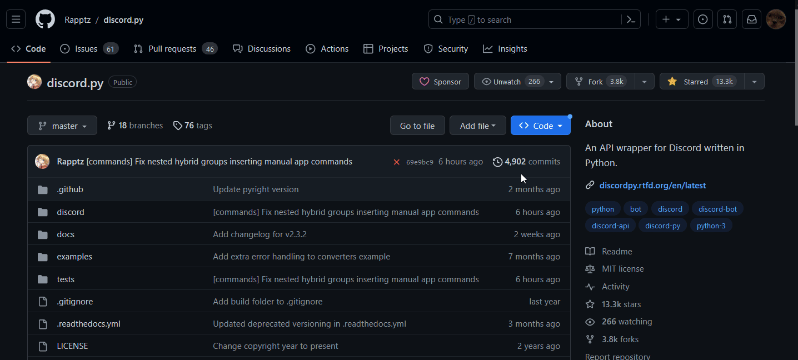

# pyready: Your Python Migration Readiness Checker
Are you planning to migrate your Python project to a new version, but you're not sure if it's ready for the transition? Enter pyready – the tool designed to simplify the migration process. pyready allows you to assess your project's readiness by analyzing its dependencies and checking for compatibility with your target Python version. It seamlessly integrates with GitHub, utilizing the Software Bill of Materials (SBOM) JSON export to gather essential information about your projects dependencies. pyready also harnesses the power of the PyPI REST API to verify if your project's dependencies support the Python version you aim to migrate to. With pyready in your toolkit, you can make informed decisions, streamline the migration process, and ensure a smooth transition to your desired Python version.

Inspired by the [pyreadiness](https://pyreadiness.org/) website. 
# How It Works
At a high level pyready follows a similar strategy to the pyreadiness folks, in that it checks for specific classifiers tied to the each dependency that would indicate whether or not it supports some Python version. 

For example if your project was using the popular Python package "aiohttp" version 3.8.3 (3.8.5 is latest), it would show up in your projects SBOM file as a package and it would also tell us what version of it you were using. Suppose you wanted to check your projects readiness for 3.11, pyready would iterate over all packages in your projects SBOM export and check [PyPi](https://pypi.org/) to see if the project in question has the `Programming Language :: Python :: 3.11` classifier via [PyPI's JSON API](https://warehouse.pypa.io/api-reference/json.html). In the case of our example, the aiohttp 3.8.3 package, pyready checks the 3.8.3 release on PyPi to see if it has the `Programming Language :: Python :: 3.11` classifier`. If no version is specified for a package in the SBOM file the latest release is assumed.

# Installation
TODO

# Usage
### Get Some Help
`pyready --help`

### Export SBOM File From GitHub Repository

### Run pyready CLI Command Using SBOM Export
`pyready [OPTIONS] PYTHON_VERSION SBOM_FILE_PATH`

### (Optional and Ugly) Get CSV Export of Results
`pyready PYTHON_VERSION SBOM_FILE_PATH --export EXPORT_FILE_NAME`

